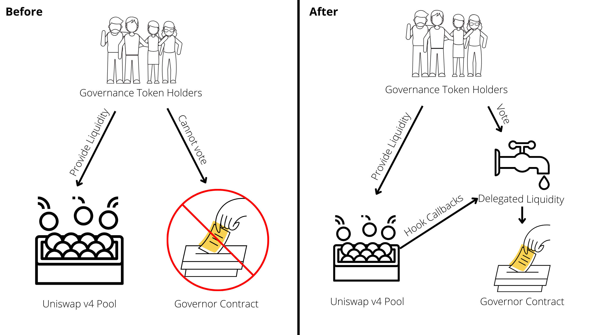

# Delegated Liquidity

<div align="center">
	
	<br />
	<br />
</div>

<p align="center">
	<b>Vote with governance tokens while providing liquidity to Uniswap v4.</b>
</p>

<div align="center">
	
	<br />
</div>

<p align="center">
	🏗️ <a href="https://twitter.com/scopelift">@ScopeLift</a>
</p>


⚠️⚠️ This codebase is currently a hackathon project quality. It should not be deployed in production as-is. Use this code at your own risk. ⚠️⚠️

## What it does

Delegated Liquidity is a Uniswap v4 Hook that allows holders of DAO governance tokens to provide liquidity while retaining the right to participate in governance votes with their share of tokens in the pool.

<div align="center">
	
	<br />
	<br />
</div>

Normally, when a holder of a governance token deposits them into a DeFi protocol, they lose the ability to vote with those tokens. That's because the tokens are held by protocol—such as the pool contract in the case of Uniswap—and the governance contracts no longer recognize the LP's ownership of them as a result.

[Flexible Voting](https://flexiblevoting.com) is an extension to the standard DAO governance contracts that allows for voting integrations to be built which overcome this limitation. It was developed by ScopeLift and has been adopted by real DAOs, including Gitcoin, PoolTogether, and Frax Finance.

By leveraging Flexible Voting and v4 Hooks, we built a Pool that enables governance token holders to LP without losing their voting rights.


## How it works

When an LP creates or modifies a position, or when a user executes a swap, the Delegated Liquidity contract receives a callback. We use this callback to record checkpointed data about the state of the Pool and the LP's positions in it.

By tracking these changes to the Pool's state, we can calculate the share of the tokens any given LP has a claim to at any given time. You can think of this calculation in this way: if the LP were to close their position right now, how many governance tokens would they be entitled to? That number represents the share of Pool's liquidity the LP ought to be able vote with.

The Delegated Liquidity contract  allows LPs to express their vote for their share of the tokens, and records these votes internally. Finally, the Delegated Liquidity contract passes the votes of all LPs forward to the Governor contract by leveraging the Flexible Voting extension, which enables fractional voting by delegates. In this case, the Delegated Liquidity acts as the voting delegate on behalf of the Pool.

The contracts were built and tested using Foundry and the Uniswap v4 development template. We the hook contract and the integration with governance, along with tests which simulate the process of an LP voting on an active proposal with their share of the liquidity.

## Development

This project uses [Foundry](https://github.com/foundry-rs/foundry). Follow [these instructions](https://github.com/foundry-rs/foundry#installation) to install it.

Clone the repo.

```bash
git clone git@github.com:ScopeLift/delegated-liquidity.git
cd delegated-liquidity
```

Instal dependencies & run tests.

```bash
forge install
forge build
forge test
```

## License

This project is available under the [MIT](LICENSE.txt) license.

Copyright (c) 2023 [ScopeLift](https://scopelift.co).
